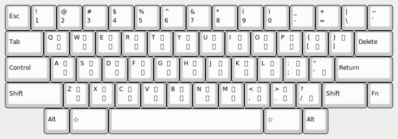

# muji-newjis101

## これは何?

英語キーボード (101 配列) 上の新 JIS かな入力で muji.el を利用したい人のためのパッケージです。

101 配列でのかなキーの対応は図のようになります
(例は Happy Hacking Keyboard 英語配列)。



## 使用法

muji-newjis101.el を `load-path` の通ったところに置いて init.el に次のように書きます。

``` emacs-lisp
(require 'muji)
(define-key global-map (kbd "C-x C-\\") 'global-muji-mode)
(load "muji-newjis101")
```

`C-x C-\` で muji グローバルマイナーモードを起動したあと `C-j` でかな (に対応するキー文字列) を変換します。

muji.el の `:` と `h;`/`k;`/`;` の代わりに `~` と `#?`/`*?`/`?` を使ってください。
`#?`/`*?` は `#`/`*` と略記できます。

例: `101~ak/y?dltj?rls'#cFjpth` `C-j` → `101配列上でかな入力`
