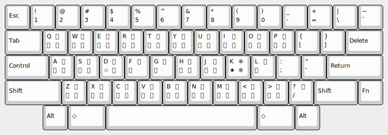

# muji-yoko50

## これは何?

[横五十音配列 (横50音配列)](http://jgrammar.life.coocan.jp/ja/tools/imekeys.htm#Yoko50) で muji.el を利用したい人のためのパッケージです。

実際の配列を図に示します
(例は Happy Hacking Keyboard 英語配列)。



## 使用法

muji-yoko50.el を `load-path` の通ったところに置いて init.el に次のように書きます。

``` emacs-lisp
(require 'muji)
(define-key global-map (kbd "C-x C-\\") 'global-muji-mode)
(load "muji-yoko50")
```

`C-x C-\` で muji グローバルマイナーモードを起動したあと `C-j` でかな (に対応するキー文字列) を変換します。

muji.el の `h;`/`k;`/`;` の代わりに `d;`/`k;`/`;` を使ってください。

例: `dlr;rmsmkjuon;kaidpb;cmd;kwkjudilt` → `横五十音配列で入力`
