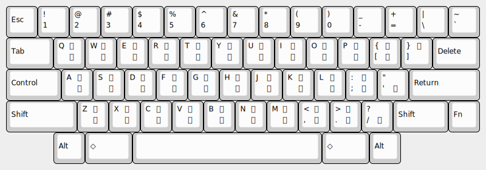

# newjis101

## これは何?

leim/quail/japanese.el (ローマ字入力) の代わりに 新 JIS かな配列 で入力を行うためのパッケージです。

実際の配列を図に示します
(例は Happy Hacking Keyboard 英語配列)。



## 使用法

newjis101.el を `load-path` の通ったところに置いて init.el に次のように書きます。

``` emacs-lisp
(require 'newjis101)
;; 好みに合わせて
;; (setq default-input-method "newjis101")
;;
;; (define-key kkc-keymap (kbd "H") nil)
;; (define-key kkc-keymap (kbd "K") nil)
;; (define-key kkc-keymap (kbd "O") nil)
;; (define-key kkc-keymap (kbd "I") nil)
;; (define-key kkc-keymap (kbd "l") nil)
;; (define-key kkc-keymap (kbd "L") nil)
;;
;; (define-key kkc-keymap (kbd "C-u") 'kkc-newjis101-ascii)
;; (define-key kkc-keymap (kbd "C-j") 'kkc-newjis101-hiragana)
;; (define-key kkc-keymap (kbd "C-k") 'kkc-katakana)
;; (define-key kkc-keymap (kbd "C-l") 'kkc-longer-phrase)
;; (define-key kkc-keymap (kbd "C-y") 'kkc-shorter-conversion)
;; (define-key kkc-keymap (kbd "C-v") 'kkc-show-conversion-list-or-next-group)
;; (define-key kkc-keymap (kbd "M-v") 'kkc-show-conversion-list-or-prev-group)
```

`(setq default-input-method "newjis101")` として `C-\` とするか、
`C-u C-\` `newjis101` `RET` とすると、
日本語入力モードに切り替わり、新 JIS かな配列で入力できます。

再度 `C-\` とすると、英字モードに戻ります。
