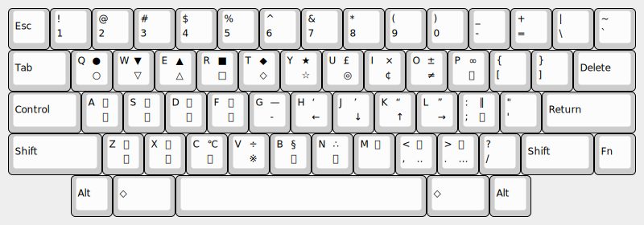
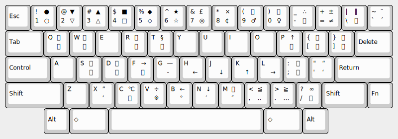

# slash shift symbols

## これは何?

leim/quail/japanese.el や muji.el のローマ字かな変換では `zh` `zj` `zk` `zl` で `←` `↓` `↑` `→` と変換されるなど、 `z`*key* による記号入力が可能ですが、
これを [横五十音配列 (横50音配列)](http://jgrammar.life.coocan.jp/ja/tools/imekeys.htm#Yoko50) 用にアレンジしたものです。

具体的には、
Shift キーを使わずに 10 列 3 段の 30 キーに収まるよう、
記号を取捨選択・再配置して
`/`*key* または `//`*key* で入力できるようにしています。

## 割り当て

`/q` → `○`, `//q` → `●` など。
`/m` は全角空白。
`///` は未割り当て (予約)。

## 参考: muji.el の記号割り当て

`z1` → `○`, `z!` → `●` など。
`zx` と `zX` は leim/quail/japanese.el では顔文字 (?) が割り当てられていたが、 muji.el では閉じ引用符に改変している。

