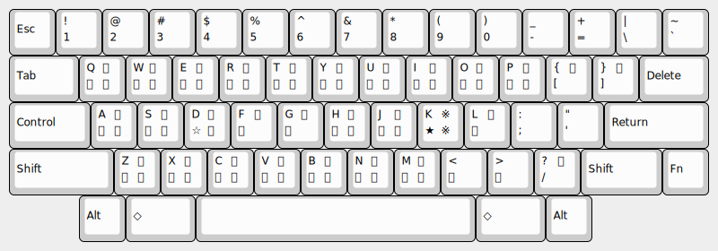

# yoko50

## これは何?

leim/quail/japanese.el (ローマ字入力) の代わりに [横五十音配列 (横50音配列)](http://jgrammar.life.coocan.jp/ja/tools/imekeys.htm#Yoko50) で入力を行うためのパッケージです。

実際の配列を図に示します
(例は Happy Hacking Keyboard 英語配列)。



## 使用法

yoko50.el を `load-path` の通ったところに置いて init.el に次のように書きます。

``` emacs-lisp
(require 'yoko50)
;; 好みに合わせて
;; (setq default-input-method "yoko50")
```

`(setq default-input-method "yoko50")` として `C-\` とするか、
`C-u C-\` `yoko50` `RET` とすると、
日本語入力モードに切り替わり、横五十音配列で入力できます。

再度 `C-\` とすると、英字モードに戻ります。
